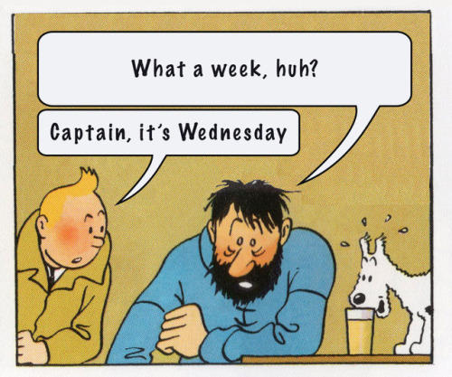

# Captain, it's Wednesday!

This tiny script automated that reminds me when it's Wednseday and asks me if I want to [tweet](https://twitter.com/cuducos/status/1374829624618811395) this meme:




## Requirements

1. Make sure you have Go 1.16 (or newer)
1. Right now, `go-twitter` doesn't have all we need, so we're using a local branch to compile:
    1. Clone [`go-twitter`](https://github.com/dghubble/go-twitter) to the parent directory (one level up from this repo's directory)
    1. Git pull [`drswork`'s branch](https://github.com/drswork/go-twitter/tree/media) there

Once [this PR](https://github.com/dghubble/go-twitter/pull/148) is merged, everything will be way easier.

## Basic usage

1. Create an app and get your API keys from [Twitter's Developer platform]([https://developer.twitter.com/](https://developer.twitter.com/))
1. Create environment variables with the keys:
    * `WEDNESDAY_CONSUMER_KEY`
    * `WEDNESDAY_CONSUMER_SECRET`
    * `WEDNESDAY_ACCESS_TOKEN`
    * `WEDNESDAY_ACCESS_TOKEN_SECRET`
1. Run with `go run main.go`

## How I use it (opinionated)

I integrated in a way that when it's Wednesday my computer asks me if I want to tweet the meme. 

First, I have generated the binary in a directory that is already in my `PATH`, for example:

```console
go build -o /usr/local/bin/it-wednesday
```

Then I call this program for every new terminal session. In my case, I [Fish](https://fishshell.com/), so I added this block to my `.config/fish/config.fish`:

```fish
set -x WEDNESDAY_CONSUMER_KEY …
set -x WEDNESDAY_CONSUMER_SECRET … 
set -x WEDNESDAY_ACCESS_TOKEN …
set -x WEDNESDAY_ACCESS_TOKEN_SECRET …
its-wednesday
```

If you use Bash or Zsh, feel free to send a PR with compatible instructions :)
